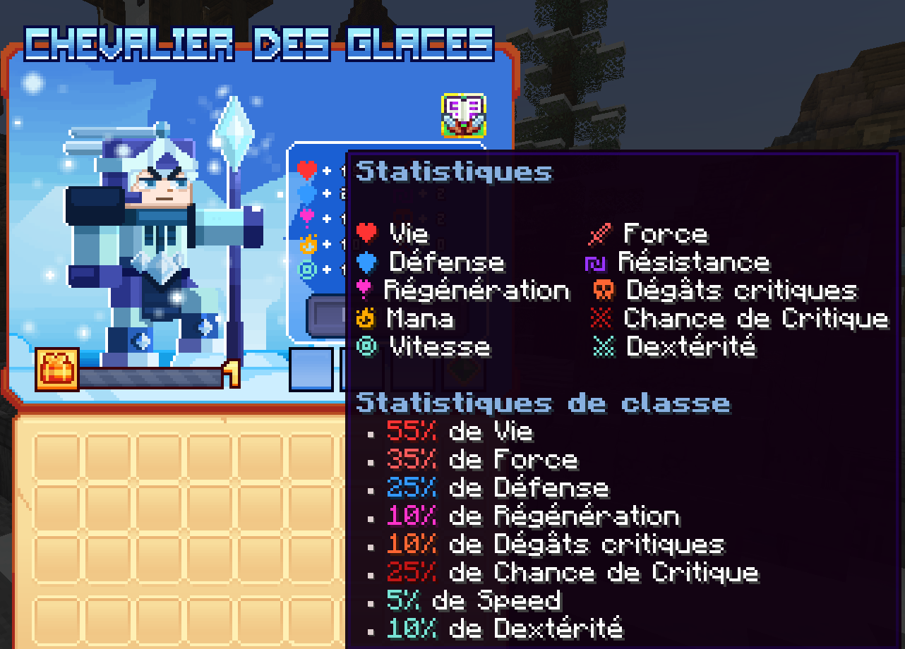

# ❄️ Chevalier des glaces

Chevalier maniant le givre, paralysant ses ennemis dans le froid et refroidi leur ardeur.

<figure><figcaption>
<strong>Aperçu des stats de la classe Chevalier des glaces</strong>
</figcaption></figure>

## <mark style="color:yellow;">Compétences</mark>

### <mark style="color:yellow;">N</mark><mark style="color:yellow;">**iveau 1 : Frappe de givre**</mark>

Effectuez une attaque tranchante avec votre lame.

* <mark style="color:yellow;">**Temps de recharge**</mark>: 0.5s
* <mark style="color:yellow;">**Mana**</mark>: 0
* <mark style="color:yellow;">**Dégâts**</mark>: 9.25

### <mark style="color:yellow;">N</mark><mark style="color:yellow;">**iveau 5 : Engelures**</mark>

Vos attaques ont 15% de chances d'infliger des engelures.

* <mark style="color:yellow;">**Temps de recharge**</mark>: 0s
* <mark style="color:yellow;">**Mana**</mark>: 0
* <mark style="color:yellow;">**Dégâts**</mark>: 15

### <mark style="color:yellow;">N</mark><mark style="color:yellow;">**iveau 10 : Lance givrée**</mark>

Invoquez votre lance glaciale et visez. Après 3 secondes, la lance glaciale se projette à grande vitesse vers l'avant, transperçant tous les ennemis.

* <mark style="color:yellow;">**Temps de recharge**</mark>: 5s
* <mark style="color:yellow;">**Mana**</mark>: 100
* <mark style="color:yellow;">**Dégâts**</mark>: 69

### <mark style="color:yellow;">N</mark><mark style="color:yellow;">**iveau 15 : Fracas glacial**</mark>

Sautez vers le haut et fracassez la surface, créant un cratère de glace. Les ennemis dans la zone du cratère sont complètement gelés.

* <mark style="color:yellow;">**Temps de recharge**</mark>: 10s
* <mark style="color:yellow;">**Mana**</mark>: 120
* <mark style="color:yellow;">**Dégâts**</mark>: 28

### <mark style="color:yellow;">N</mark><mark style="color:yellow;">**iveau 20 : Charge arctique**</mark>

Concentrez votre énergie glaciaire et foncez en avant. Les ennemis touchés sont projetés en arrière. Vous laissez derrière vous un chemin de glace qui ralentit et endommage les ennemis.

* <mark style="color:yellow;">**Temps de recharge**</mark>: 10s
* <mark style="color:yellow;">**Mana**</mark>: 125
* <mark style="color:yellow;">**Dégâts**</mark>: 18.25

### <mark style="color:yellow;">N</mark><mark style="color:yellow;">**iveau 30 : Bouclier gelé**</mark>

Déployez un bouclier de glace empêchant les ennemis d'approcher en bloquant les projectiles. Après quelques secondes, votre bouclier est projeté vers l'avant, repoussant les ennemis.

* <mark style="color:yellow;">**Temps de recharge**</mark>: 5s
* <mark style="color:yellow;">**Mana**</mark>: 100
* <mark style="color:yellow;">**Dégâts**</mark>: 55

### <mark style="color:yellow;">N</mark><mark style="color:yellow;">**iveau 40 : Percée glaciale**</mark>

Percez les défenses de vos ennemis avec votre lance , vos deux premières frappes repoussent les ennemis. La troisième fait décoller vos ennemis et la quatrième cloue les ennemis au sol, les emprisonnant dans la glace.

* <mark style="color:yellow;">**Temps de recharge**</mark>: 25s
* <mark style="color:yellow;">**Mana**</mark>: 350
* <mark style="color:yellow;">**Dégâts**</mark>: 20 les deux premières attaques et 35 les deux dernières attaques
