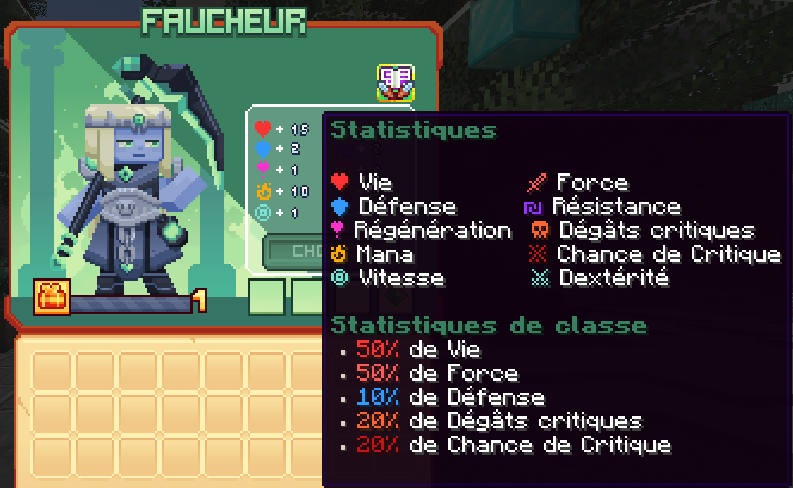

# 💀 Faucheur

Fusion d'une discipline millénaire et d'une dévotion inflexible à la mort, le Faucheur aiguise sa faux prêt à accomplir son devoir éternel.

<figure><figcaption>
<strong>Aperçu des stats de la classe Faucheur</strong>
</figcaption></figure>

## <mark style="color:blue;">Compétences</mark>

### <mark style="color:blue;">N</mark><mark style="color:blue;">**iveau 1 : Tranchant d'âme**</mark>

Libère une orbe chargée d'énergie qui explose à l'impact, endommageant les ennemis proches.

* <mark style="color:blue;">**Temps de recharge**</mark>**:** 0.5s
* <mark style="color:blue;">**Mana**</mark>**:** 0
* <mark style="color:blue;">**Dégâts**</mark>**:** 7.5 les deux premières attaques, 9.5 la troisième et 15 la quatrième

### <mark style="color:blue;">N</mark><mark style="color:blue;">**iveau 5 : Collecteur d'âme**</mark>

Chaque attaque et compétence vous donne une âme.

* <mark style="color:blue;">**Temps de recharge**</mark>**:** 0s
* <mark style="color:blue;">**Mana**</mark>**:** 0
* <mark style="color:blue;">**Dégâts**</mark>**:** 0

### <mark style="color:blue;">N</mark><mark style="color:blue;">**iveau 10 : Tour de la mort**</mark>

Déclenchez des attaques tournantes tout en vous précipitant vers l'avant.

* <mark style="color:blue;">**Temps de recharge**</mark>**:** 7s
* <mark style="color:blue;">**Mana**</mark>**:** 100
* <mark style="color:blue;">**Dégâts**</mark>**:** 20

### <mark style="color:blue;">N</mark><mark style="color:blue;">**iveau 15 : Griffe du faucheur**</mark>

Invoquez les griffes de la faucheuse qui attirent tous les ennemis vers vous

* <mark style="color:blue;">**Temps de recharge**</mark>**:** 60s
* <mark style="color:blue;">**Mana**</mark>**:** 50
* <mark style="color:blue;">**Dégâts**</mark>**:** 54

### <mark style="color:blue;">N</mark><mark style="color:blue;">**iveau 20 : Surtension**</mark>

Devenez invisible et foncez rapidement vers l'avant, en lançant une attaque croisée repoussant les ennemis.

* <mark style="color:blue;">**Temps de recharge**</mark>**:** 10s
* <mark style="color:blue;">**Mana**</mark>**:** 125
* <mark style="color:blue;">**Dégâts**</mark>**:** 55

### <mark style="color:blue;">N</mark><mark style="color:blue;">**iveau 30 : Faux d'âme**</mark>

Invoquez le faux de la grande faucheuse et coupez vos ennemis, tout en drainant leurs âmes et en vous soignant.

* <mark style="color:blue;">**Temps de recharge**</mark>**:** 30s
* <mark style="color:blue;">**Mana**</mark>**:** 350
* <mark style="color:blue;">**Dégâts**</mark>**:** 20

### <mark style="color:blue;">N</mark><mark style="color:blue;">**iveau 40 : Dieu des morts**</mark>

Tranchant d'âme sera transformé par une série de trois frappes. Le deuxième coup projette les ennemis et le troisième libère une vague d'âme sombre effrayant les ennemis.

* <mark style="color:blue;">**Temps de recharge**</mark>**:** 60s
* <mark style="color:blue;">**Mana**</mark>**:** 350
* <mark style="color:blue;">**Dégâts**</mark>**:** 45 la première attaque, 57 la deuxième et 90 la troisième
