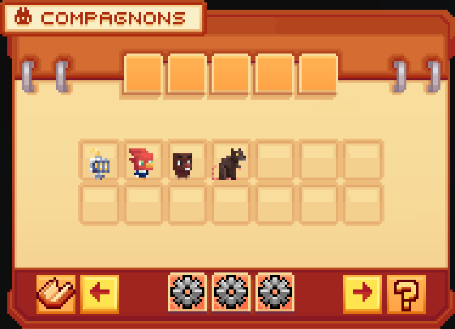

# ⚔️ Guerrier

Le Guerrier est une classe robuste, excelle dans le combat rapproché et dispose d'une défense élevée. Avec une variété de compétences, le Guerrier peut infliger de lourds dégâts tout en résistant aux attaques ennemies.

<figure><figcaption>
<strong>Aperçu des stats de la classe Guerrier</strong>
</figcaption></figure>

## <mark style="color:green;">Compétences</mark>

### <mark style="color:green;">**Niveau 1 : Frappe Brutale**</mark>

Effectuez une large gamme d'attaques tranchantes et perçantes.

* <mark style="color:green;">**Temps de recharge**</mark>**:** 0.5s
* <mark style="color:green;">**Mana**</mark>**:** 0
* <mark style="color:green;">**Dégâts**</mark>**:** 4

### <mark style="color:green;">**Niveau 5 : Carnage**</mark>

Votre vitesse et votre défense augmentent en cas de dégâts lorsque votre santé est inférieure à 30% de vos PV max.

* <mark style="color:green;">**Temps de recharge**</mark>**:** 0s
* <mark style="color:green;">**Mana**</mark>**:** 0
* <mark style="color:green;">**Dégâts**</mark>**:** 0

### <mark style="color:green;">**Niveau 10 : Charge**</mark>

Bondissez en avant pour vous rapprocher de votre cible.

* <mark style="color:green;">**Temps de recharge**</mark>**:** 5s
* <mark style="color:green;">**Mana**</mark>**:** 50
* <mark style="color:green;">**Dégâts**</mark>**:** 5

### <mark style="color:green;">**Niveau 15 : Bouclier**</mark>

Invoquez 4 boucliers qui vous protègent et repoussent les cibles proches. Un bouclier se brisera si vous êtes attaqué, mais vous ne subirez aucun dégât.

* <mark style="color:green;">**Temps de recharge**</mark>**:** 15s
* <mark style="color:green;">**Mana**</mark>**:** 100
* <mark style="color:green;">**Dégâts**</mark>**:** 0

### <mark style="color:green;">**Niveau 20 : Chaîne**</mark>

Lancez une chaîne qui tire la cible vers vous.

* <mark style="color:green;">**Temps de recharge**</mark>**:** 5s
* <mark style="color:green;">**Mana**</mark>**:** 100
* <mark style="color:green;">**Dégâts**</mark>**:** 48

### <mark style="color:green;">**Niveau 30 : Tourbillon**</mark>

Faites tourner votre épée, endommageant les cibles proches.

* <mark style="color:green;">**Temps de recharge**</mark>**:** 10s
* <mark style="color:green;">**Mana**</mark>**:** 150
* <mark style="color:green;">**Dégâts**</mark>**:** 36

### <mark style="color:green;">N</mark><mark style="color:green;">**iveau 40 : Jugement**</mark>

Chargez vers l'avant avec un énorme bouclier qui endommage et étourdit les cibles. Vous bondissez et invoquez l'épée du jugement, brisant la surface, endommageant et étourdissant les cibles proches.

* <mark style="color:green;">**Temps de recharge**</mark>**:** 30s
* <mark style="color:green;">**Mana**</mark>**:** 300
* <mark style="color:green;">**Dégâts**</mark>**:** 80
